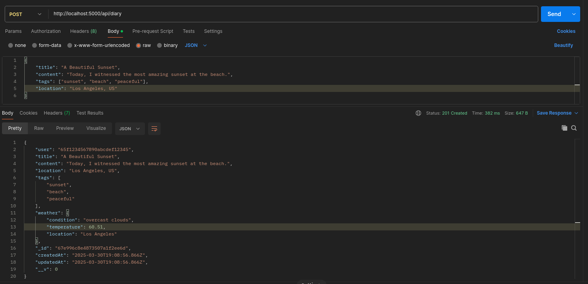
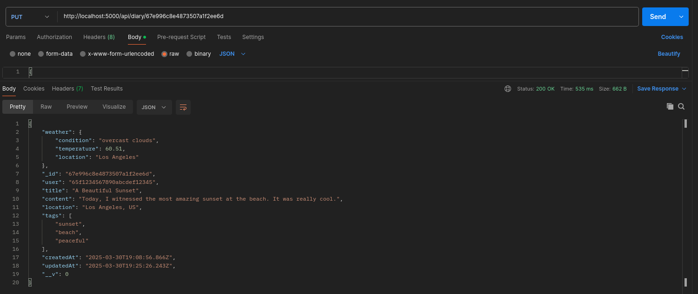
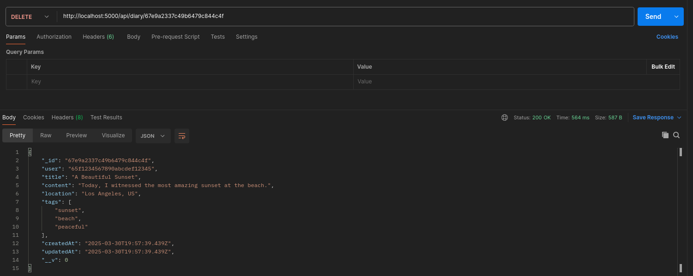

# ThoughtStream: Reflect, Record, Remember

This is a diary app. You can write down your thoughts, and it will save it along with the weather of that day.

## Setup

### Initial Setup
Install Required Packages
```bash
npm install express mongoose dotenv cors axios
```

Install Required Packages for Development
```bash
npm install nodemon --save-dev
```

### Run

Production

```bash
npm start
```

Development

```bash
npm run dev
```

## API Usage Guide

GET /api/diary
    Gets all the diary entries. Can use parameters to filter diary entries.

POST /api/diary
    Create a new diary entry. Need to provide the title, content, and location (City, Country Code).

GET /api/diary/:id
    Get the diary entry on a given diary ID.

PUT /api/diary/:id
    Update the diary entry on a given diary ID.

DELETE /api/diary/:id
    Delete the diary entry on a given diary ID.

## Environment Variables

MONGO_URI="mongodb+srv://://<username>:<password>@cluster0.nahw65o.mongodb.net/?retryWrites=true&w=majority&appName=Cluster0"
WEATHER_API="<open weather api token>"

## Common Issues & Debugging Tips

Authorization not implemented yet, so currently user id is hard-coded if no user id is provided. Will remove once authorization is implemented.

## API Testing Results





## Extra Credit

None