# ThoughtStream - Full Stack Diary Application 📝

ThoughtStream is a personal diary application built with:

- Backend: Node.js + Express + MongoDB
- Frontend: React + Vite + Google OAuth login
- JWT authentication for secure access

---

## Project Setup Instructions

This project contains **two parts**:

- **Backend** (Express API)
- **Frontend** (React Vite App)

## Backend Setup

### Step 1: Go to Backend Folder

```bash
cd backend
npm install
```

### Step 2: Create .env file in backend

```
MONGO_URI="mongodb+srv://<username>:<password>@cluster0.nahw65o.mongodb.net/?retryWrites=true&w=majority&appName=Cluster0"
WEATHER_API="<open weather api token>"
GOOGLE_CLIENT_ID=<google client id>
GOOGLE_CLIENT_SECRET=<google client secret>
GOOGLE_CALLBACK_URL=http://localhost:5000/auth/google/callback
SESSION_SECRET=<64 char generated secret>
PORT=5000
JWT_SECRET=<user generated secret>
```

### Step 3: Start Backend Server

```bash
npm start
```

## Frontend Setup

### Step 1: Go to Frontend Folder

```bash
cd frontend
npm install
npm install @react-oauth/google
```

### Step 2: Create .env file in frontend

```
VITE_API_BASE_URL=http://localhost:5000/api
VITE_GOOGLE_CLIENT_ID=your-google-oauth-client-id
CLIENT_SECRET=secret-key-from-google-ouath
```

### Step 3: Setup the OAuth Client

LINK: https://www.youtube.com/watch?v=GuHN_ZqHExs

### Step 4:

```bash
npm run dev
```

## User Guide

Go to http://localhost:5173/. Users will first be met with a login page to log into Google OAuth.

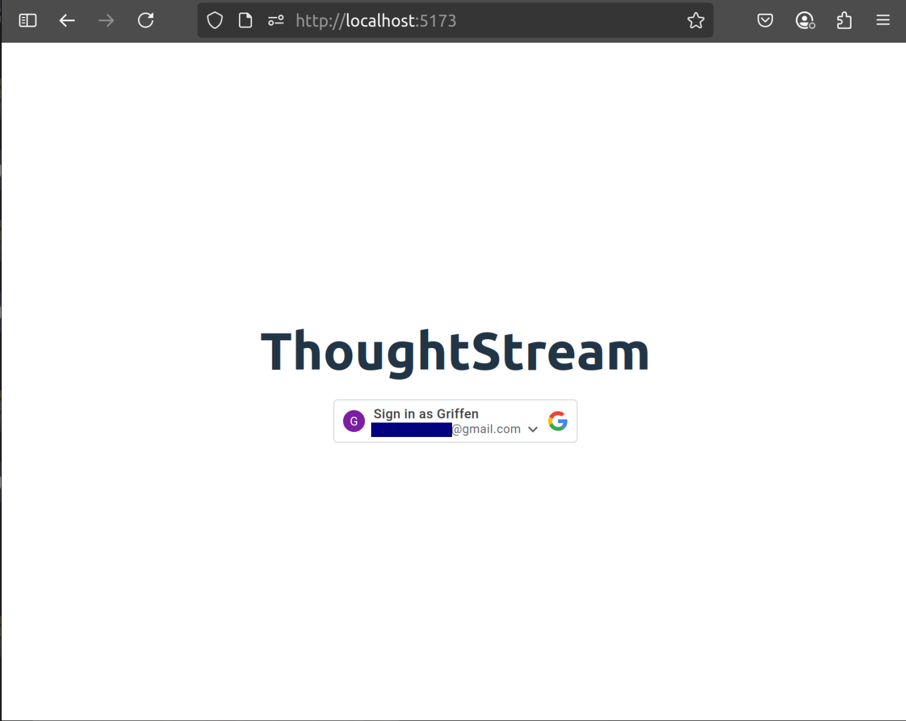

When pressing the login button to sign in, the user will be prompted to confirm the login.

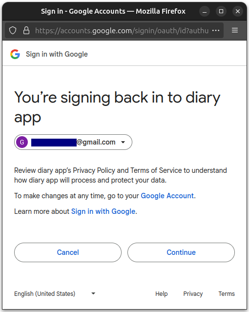

The user will be redirected to http://localhost:5173/dashboard, where the user can see existing posts. If the user attempts to reach this page without signing in, the user will not be able to view anything. The text in the dashboard screenshot below is the same if the user has no posts in the database.

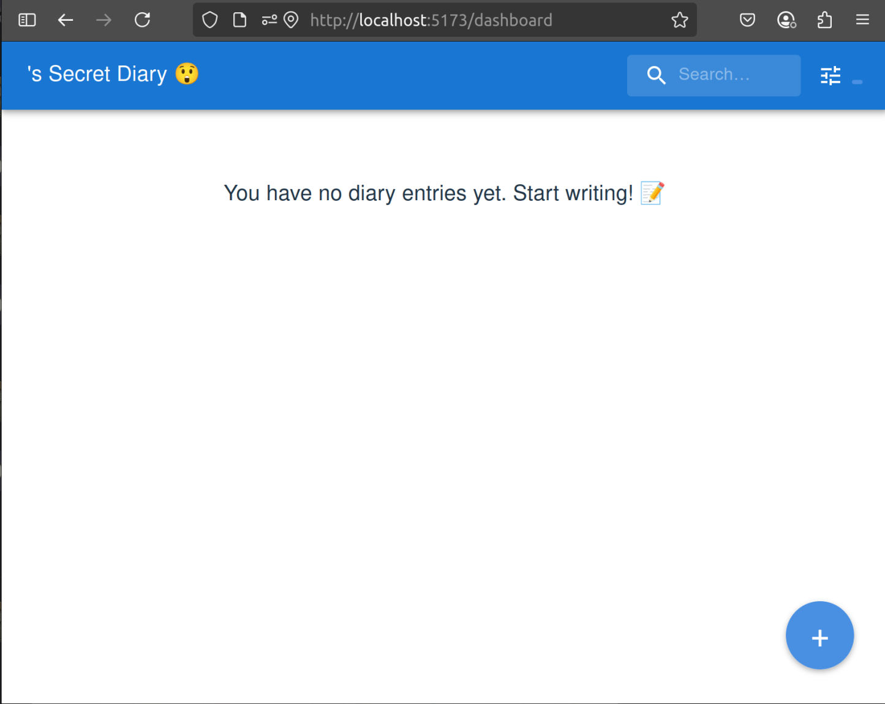

When users sign in and put in some entries, this is what the dashboard looks like.

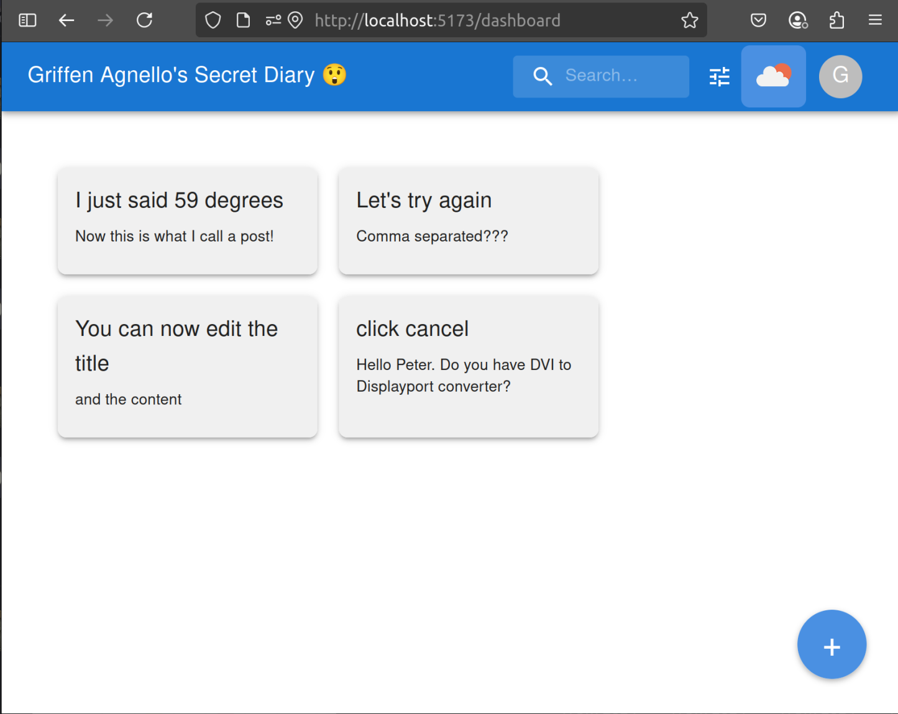

By pressing on of the entries, the user can see the full diary entry content. They can also make edits to it, or delete it.

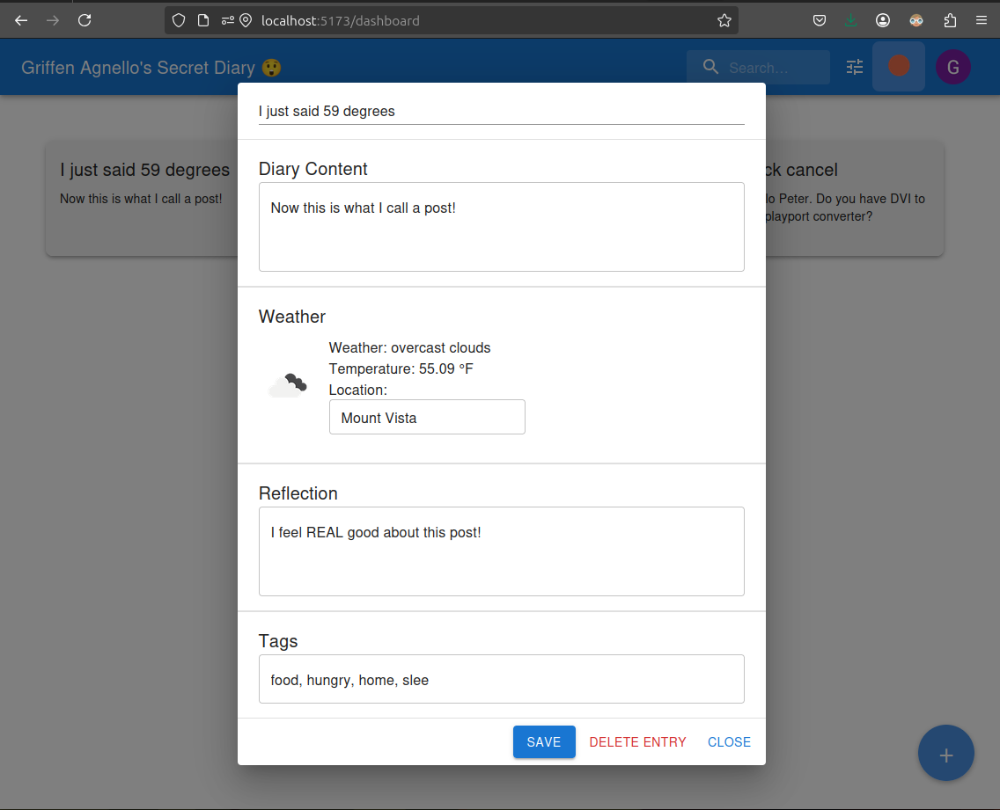

By pressing the blue plus (+) button in the bottom right corner, the user can create a new entry.

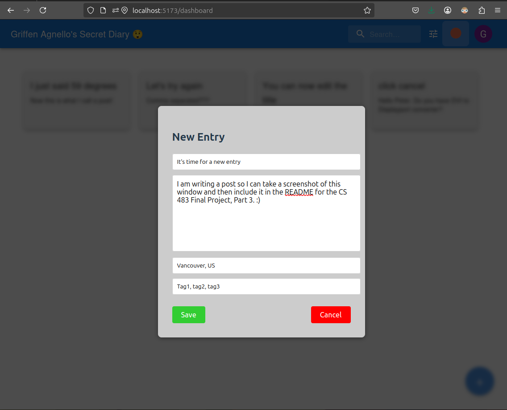

The weather widget in the top right of the dashboard can be pressed to show the current weather for the user's location.

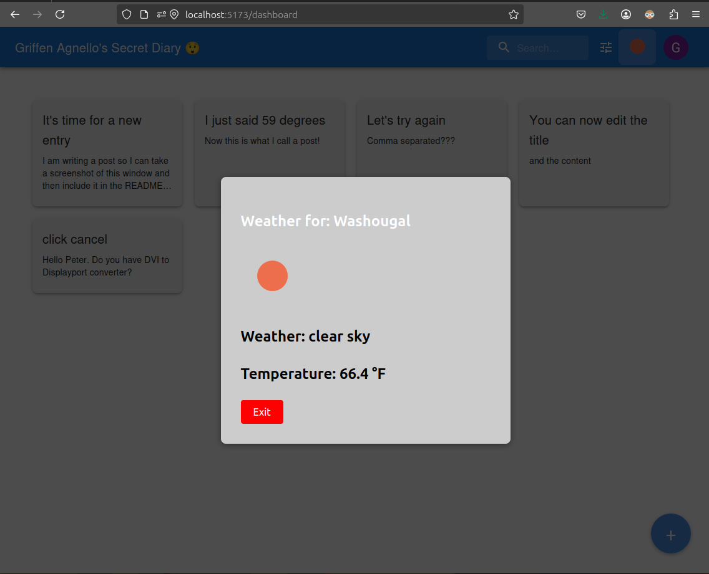

The user is able to use the search bar to look up words that appear in some diary entry content.

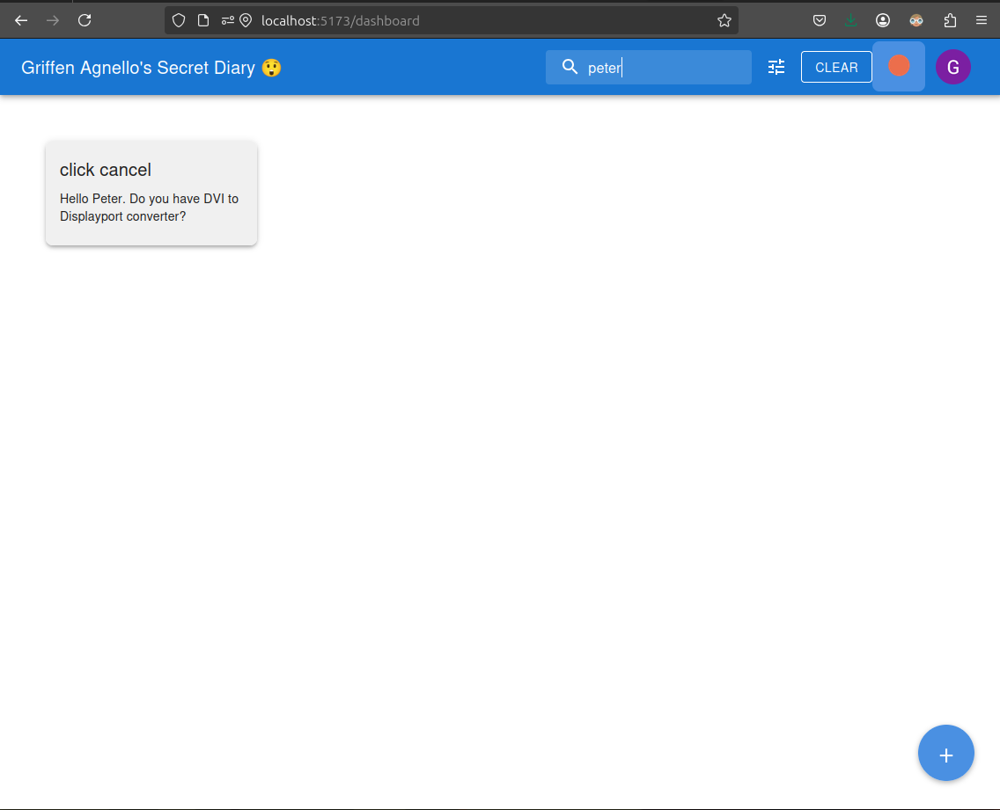

The user can also press the filter button to open up a dropdown menu to filter entries by their location or tags.

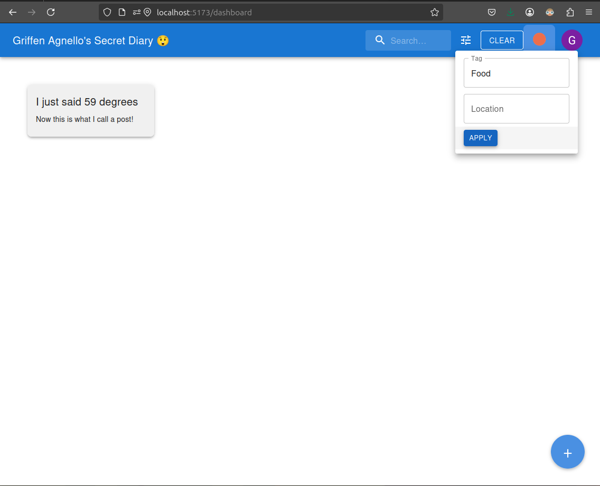

The website was designed for mobile viewports as well.

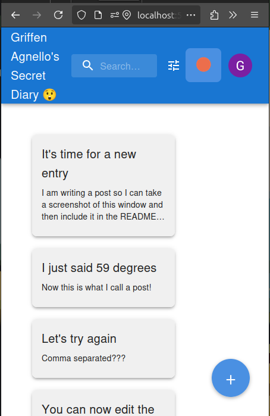

## React Design Flow

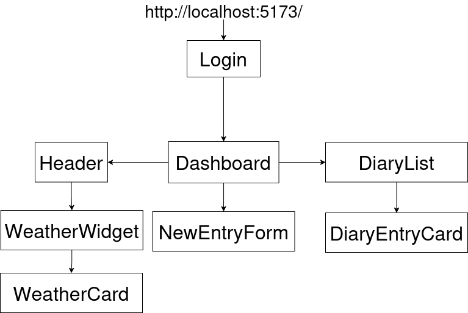